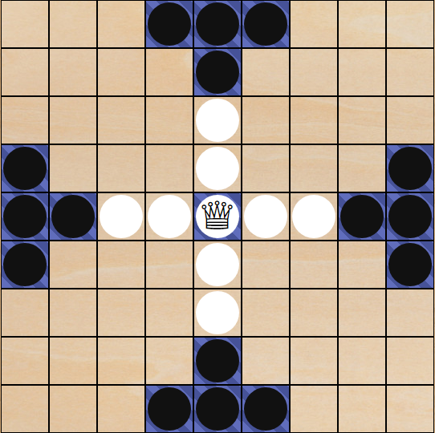
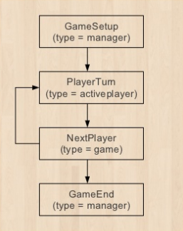

# Tablut

[](https://travis-ci.org/Lucas-C/tablut)
[](https://waffle.io/Lucas-C/tablut)

Tablut board game implementation for [BoardGameArena](https://boardgamearena.com).



Rules:
- [in English](http://en.doc.boardgamearena.com/Gamehelptablut)
- [in French](http://fr.doc.boardgamearena.com/Gamehelptablut)

Feel free to report bugs, send pull requests or even express feature requests through the _issues_ section of this GitHub project.

## Game state machine

Very basic:




# Development

## Installation
```
composer install
npm install
```

## Code validation
```
composer check-php
composer test  # require a MySQL daemon running
composer test -- --filter testSimpleGetGameProgression
composer bgaw-validate

npm test
npm run lint-js
npm run lint-css
```

## Deploying to Studio
```
cp bgaproject.yml.dist bgaproject.yml
# then fill in sftp properties
composer bgaw-deploy
```

## Continuous Deployment to Studio

Watches development files and deploys them as they change.
```
composer bgaw-watch
```
