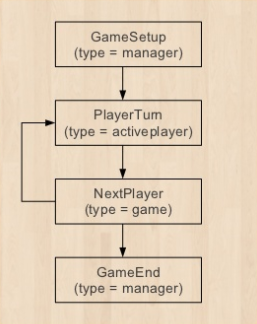

# Tablut

[](https://travis-ci.org/Lucas-C/tablut)

Implémentation du jeu [Tablut](http://jeuxstrategieter.free.fr/Tablut_complet.php) pour [BoardGameArena](https://boardgamearena.com).

## Game state machine

Very basic:




# Development

## Running Tests
```
composer test
composer bga-validate
composer fix-styles
```

## Validating Javascript
```
npm install -g eslint eslint-config-strict eslint-plugin-filenames
eslint --fix tablut.js
```

## Deploying to Studio
```
composer deploy
```

## Continuous Deployment to Studio

Watches development files and deploys them as they change.
```
bgawb build -w -d
```

<!--TODO:
- add images:
    * img/game_box.png
    * img/game_box75.png
    * img/game_box180.png
    * img/game_icon.png
    * img/publisher.png
	
	* Test
-->
